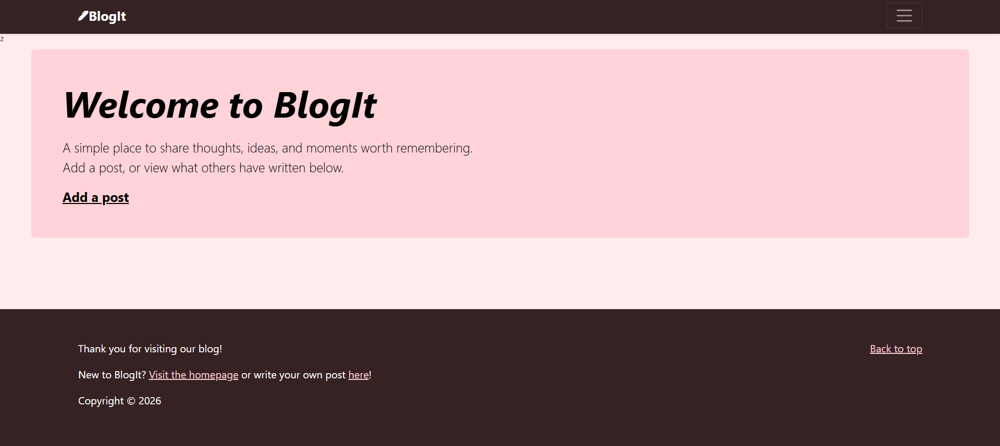
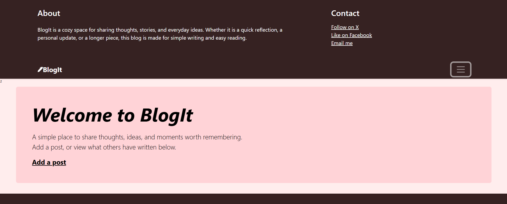
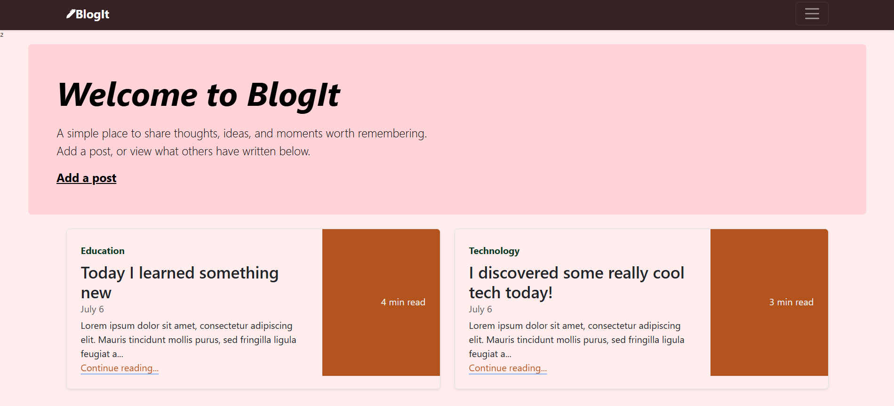
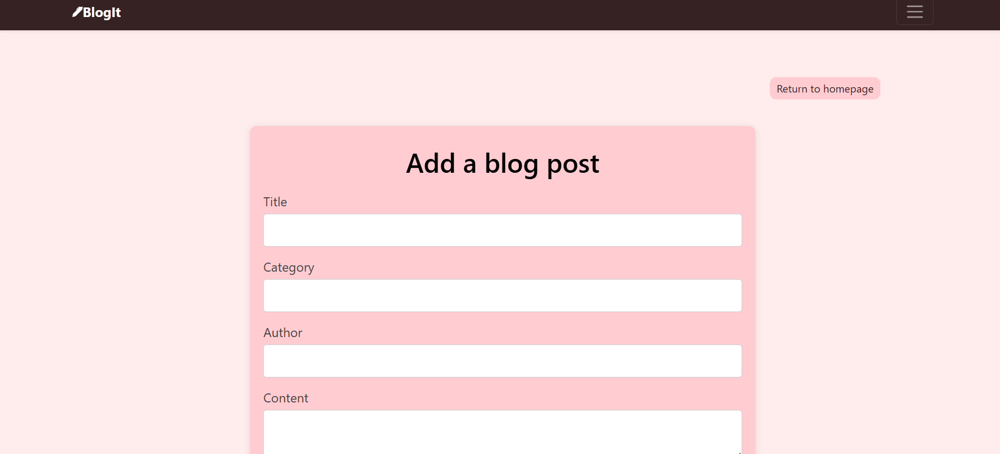
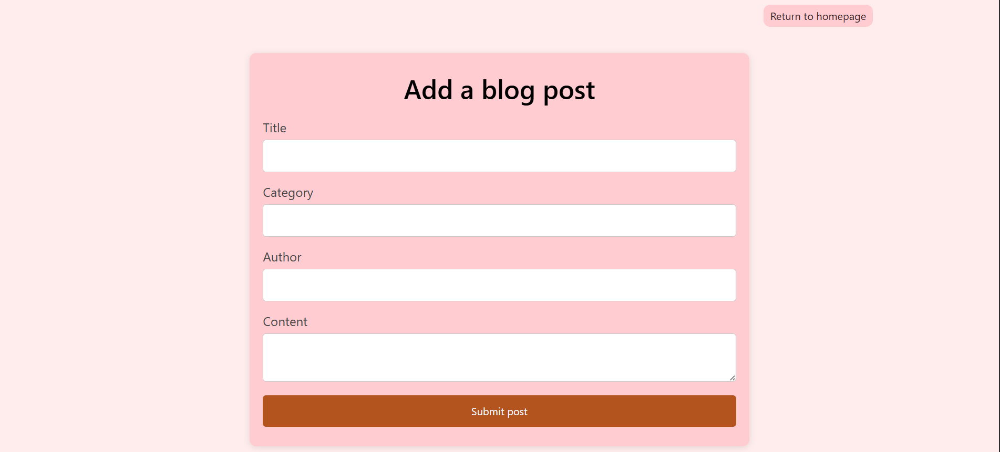
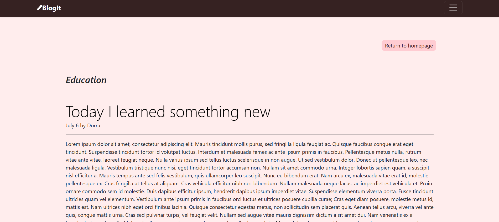
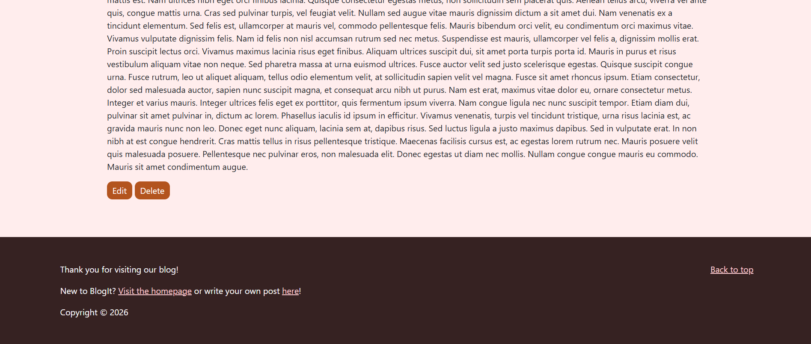
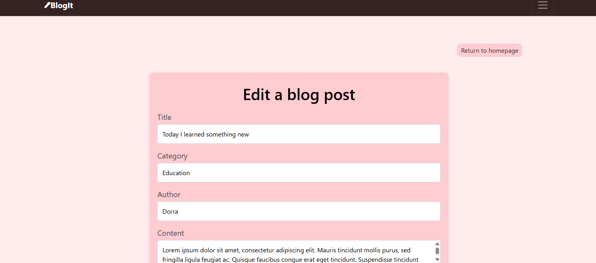
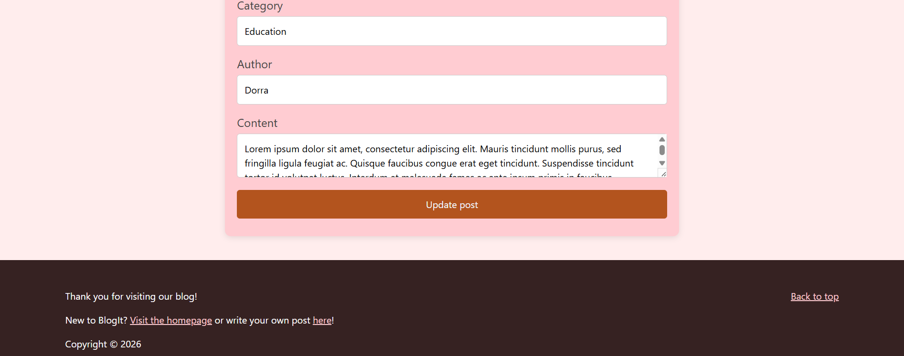

# BlogIt - Blog Website Project

## About the Project

BlogIt is a blog website built with Node.js, Express.js, EJS, Bootstrap, and custom CSS.

The website allows users to create, view, edit, and delete blog posts. Each post includes a title, category, author, content, date, and preview text. Posts are displayed on the homepage as blog preview cards, and each post can be opened on its own page for full reading.

This project does not use a database yet. Posts are stored temporarily in an array while the server is running, so the data is lost when the server restarts.

## Project Type

This is a backend and EJS practice project that I built myself.

The goal of this project was to practice building a dynamic multi-page website with Express, EJS, routes, forms, partials, temporary server-side data storage, and full CRUD functionality without using a database yet.

## Technologies Used

- Node.js
- Express.js
- EJS
- JavaScript
- HTML
- CSS
- Bootstrap
- body-parser
- Nodemon

## Features

- Homepage displaying all blog posts
- Dynamic blog preview cards
- Add a new blog post
- View a full blog post
- Edit an existing blog post
- Delete a blog post
- Store posts temporarily in a JavaScript array
- Generate a short preview from the post content
- Automatically add the current date to each post

## What I practiced

- Setting up an Express.js server
- Creating GET and POST routes
- Rendering EJS templates with `res.render()`
- Passing data from Express to EJS
- Using EJS loops to display dynamic content
- Using EJS partials for shared layout sections
- Handling form submissions with body-parser
- Reading form data from `req.body`
- Using query parameters with `req.query`
- Using hidden form inputs to pass post IDs
- Searching arrays with `.find()`
- Finding item positions with `.findIndex()`
- Removing items with `.splice()`
- Redirecting users with `res.redirect()`
- Creating post previews with `.slice()`
- Generating dates with JavaScript
- Serving static files with `express.static()`
- Combining Bootstrap components with custom CSS
- Using Nodemon to automatically restart the server during development


## Live Demo

For now, the project can be run locally using Node.js or Nodemon.

## Screenshots

Screenshots are included to show the main pages and features of the application.

### Homepage





### Add Post Page




### Post View Page




### Edit Post Page




## Installation

Install the project dependencies:

```bash
npm install
```

If needed, install `body-parser` directly:

```bash
npm install body-parser
```

If Nodemon is not installed yet, install it:

```bash
npm install -g nodemon
```

## Running the Project

Run the server normally with Node:

```bash
node index.js
```

Or run the server with Nodemon:

```bash
nodemon index.js
```

Then open the project in the browser:

```text
http://localhost:3000
```

## Project Structure

```text
project-folder/
├── index.js
├── package.json
├── package-lock.json
├── public/
│   └── style.css
├── screenshots/
│   ├── 1.png
│   ├── 2.png
│   ├── 3.png
│   └── 4.png
|   ├── 5.png
│   ├── 6.png
│   ├── 7.png
|   ├── 8.png
│   └── 9.png
└── views/
    ├── index.ejs
    ├── post-add.ejs
    ├── post-view.ejs
    ├── post-update.ejs
    └── partials/
        ├── header.ejs
        └── footer.ejs
```

## Status

Completed as a backend and EJS practice project.
