# BlogIt - Blog Website Project

## About the Project

BlogIt is a full-stack blog website project built with Node.js, Express.js, EJS, PostgreSQL, React, Vite, Bootstrap, and custom CSS.

This project is an upgraded version of a previous BlogIt project. The first version focused on basic backend routing, EJS templates, form handling, CRUD operations, and temporary server-side data storage using a JavaScript array.

The upgraded version expands the project into a more complete blogging platform with persistent database storage, user authentication, user profiles, user-specific posts, comments, likes, bookmarks, search, and React-powered dynamic sections inside an existing Express/EJS application.

Users can browse blog posts, create an account, log in, publish their own posts, view their personal posts, edit or delete their posts, comment on posts, like comments, bookmark posts, search for authors, and manage their profile.

## Project Type

This is a full-stack web development practice project.

The goal of the upgraded version was to take the original Express/EJS blog project further by adding database persistence, authentication, protected routes, user-specific content, API routes, React components, and more interactive functionality.

This project helped me practice how a traditional Express/EJS backend can work together with React components mounted into specific pages.

## Previous Version

The previous version of BlogIt included:

- Homepage displaying blog preview cards
- Add post page
- Full post view page
- Edit post page
- Delete post functionality
- Basic CRUD operations
- Express routes
- EJS templates
- EJS partials
- Form handling with body-parser
- Temporary post storage using a JavaScript array
- Automatic date generation
- Preview text generated from post content
- Bootstrap layout and custom CSS

In the first version, posts were stored temporarily in memory. This meant that all posts disappeared when the server restarted.

## Updated Version

The upgraded version keeps the original blog idea but adds a much more complete application structure.

The new version includes:

- PostgreSQL database integration
- Persistent blog posts stored in a database
- User signup and login
- Local authentication with email and password
- Google authentication
- Password hashing with bcrypt
- Session management
- PostgreSQL session store
- Protected pages for logged-in users
- User profiles
- Profile editing
- Profile deletion
- User-specific “My Posts” page
- Bookmarks page
- Comment system
- Comment likes
- Comment deletion by the comment author
- Author search
- React-powered post cards
- React-powered user area in the navbar
- React-powered full post page
- React-powered comments section
- React-powered bookmarks page
- React-powered search results page
- API routes used by React components
- Environment variables with dotenv
- Improved navigation and layout
- Dynamic FAQ page
- Updated About page

## Technologies and Tools Used

### Backend

- Node.js
- Express.js
- JavaScript
- body-parser
- dotenv

### Server-Side Rendering and Templates

- EJS

### Database

- PostgreSQL
- pg
- SQL
- connect-pg-simple

## Database Structure

The upgraded version uses PostgreSQL to store persistent application data.

The main tables are:

- `users` — stores user account information, including name, email, password, profile image, and number of posts.
- `posts` — stores blog posts created by users. Each post is connected to a user through a foreign key.
- `comments` — stores comments written on posts. Each comment is connected to both a post and a user.
- `bookmarks` — stores bookmarked posts for each user. It connects users and posts using foreign keys.
- `liked_comments` — stores which users liked which comments. It connects users and comments using foreign keys.
- `session` table — stores login session information using PostgreSQL session storage.

The database uses relationships between users, posts, comments, bookmarks, and liked comments so that the app can support user-specific posts, comments, likes, bookmarks, and authentication sessions.

### Authentication and Security

- Passport.js
- Passport Local Strategy
- Google OAuth 2.0
- express-session
- bcrypt
- Environment variables

### Frontend

- React
- Vite
- JSX
- Bootstrap
- CSS
- HTML
- Font Awesome
- Material UI Icons

### Frontend/API Communication

- Axios

### Development Tools

- npm
- Nodemon
- Git
- GitHub
- VS Code

## Features

### General Features

- Homepage with blog post previews
- Full post view page
- Add new blog posts
- Edit existing blog posts
- Delete blog posts
- Post preview cards
- Search page
- FAQ page
- About page
- Responsive layout using Bootstrap
- Custom styling with CSS

### User Authentication

- Sign up with full name, email, password, and optional image URL
- Log in with email and password
- Sign up or log in with Google
- “Remember me” option
- Password hashing with bcrypt
- Session-based authentication
- Persistent sessions stored in PostgreSQL
- Login error messages
- Signup error messages
- Logout functionality

### User-Specific Features

- Protected “My Posts” page
- Protected bookmarks page
- Protected post creation
- User dropdown in the navbar when logged in
- Login and signup buttons when logged out
- Profile page displaying user information
- Number of posts displayed on the profile page
- Edit profile page
- Update name, email, image URL, and password for local accounts
- Update image URL for Google accounts
- Delete profile functionality

### Post Features

- Create posts as a logged-in user
- Store posts in PostgreSQL
- View all posts on the homepage
- View only the logged-in user's posts on the My Posts page
- Edit posts
- Delete posts
- Only the post author can see edit and delete buttons
- Automatically generate post date and time
- Automatically generate post previews
- Order posts by latest timestamp

### Comment Features

- Add comments to posts
- Display comments for each post
- Store comments in PostgreSQL
- Show comment author information
- Show comment author image
- Show relative comment time
- Delete comments created by the logged-in user
- Like and unlike comments
- Store liked comments in the database
- Update comment like counts

### Bookmark Features

- Bookmark posts
- Remove bookmarks
- Store bookmarks in PostgreSQL
- Display bookmarked posts on a dedicated bookmarks page
- Only logged-in users can use bookmarks

### Search Features

- Search for posts by author name
- Render matching posts on a search page
- Use React to load and display searched posts dynamically

### React Integration Features

- React components are mounted into selected EJS pages
- React handles dynamic post previews
- React handles the user area in the navbar
- React handles the full post card
- React handles comments
- React handles bookmarks
- React handles searched posts
- Axios is used to request data from Express API routes
- Vite is used for the React development setup

## What I Learned

### Backend and Express

- How to structure a larger Express.js application
- How to create page-rendering routes
- How to create API routes for frontend components
- How to protect routes using authentication checks
- How to use `req.isAuthenticated()` and `Passport.authenticate()` 
- How to use `req.user`
- How to handle GET and POST requests and redirect users
- How to send JSON responses from Express
- How to combine EJS-rendered pages with React components

### Database and SQL

- How to connect an Express app to PostgreSQL
- How to use the `pg` package
- How to insert users, posts, comments, bookmarks, and likes into a database
- How to retrieve data with SQL queries
- How to join tables
- How to filter data by user ID
- How to search with SQL
- How to update database records
- How to delete database records
- How to use `RETURNING *`
- How to use parameterized queries
- How to persist login sessions

### Authentication

- How to use Passport.js
- How to create local authentication with email and password
- How to hash passwords with bcrypt
- How to compare passwords securely
- How to use Google OAuth
- How to handle users who sign in with Google
- How to handle users who sign in locally
- How to manage sessions with express-session
- How to store sessions in PostgreSQL
- How to use environment variables for secrets and credentials
- How to implement remember-me session behavior
- How to prevent Google users from loggin in using the local strategy and vice-versa

### React

- How to create reusable React components
- How to mount React components into EJS pages
- How to use multiple React roots in the same Express/EJS project
- How to fetch data with Axios
- How to use `useState`
- How to use `useEffect`
- How to pass props between nested components
- How to render arrays of data with `.map()`
- How to conditionally render UI based on logged-in state
- How to build interactive UI features such as bookmarks and likes

### Full-Stack Concepts

- How a backend route can serve an EJS page
- How a React component can request data from an Express API route
- How frontend and backend responsibilities can be separated
- How authentication affects frontend rendering
- How database data moves from PostgreSQL to Express to React
- How user-specific content is loaded dynamically
- How to gradually upgrade a backend project into a more complete full-stack application

## How It Works

### General Application Flow

The Express server renders the main EJS pages and provides API routes for React components.

The EJS templates provide the page structure, layout, and mounting points for React. React components are then mounted into specific `div` elements depending on the page.

For example, the homepage includes a React root for displaying posts, while the post view page includes React roots for the full post card and the comments section.

The React components use Axios to request data from the backend API routes. The backend queries PostgreSQL and returns the requested data to React as JSON.

### Previous Version Flow

In the first version, posts were stored in a JavaScript array inside the server.

The flow was:

```text
User submits form → Express reads req.body → Post is added to an array → EJS renders the updated page
```

This worked for practicing basic CRUD logic, but the data was temporary.

### Updated Version Flow

In the upgraded version, posts are stored in PostgreSQL.

The new flow is:

```text
User submits form → Express reads req.body → Data is inserted into PostgreSQL → Express redirects or React fetches updated data → Page displays persistent content
```

This means posts, users, comments, likes, and bookmarks can stay stored even after the server restarts.

### Authentication Flow

Users can create an account with email and password or sign in with Google.

For local signup, the password is hashed using bcrypt before being stored in the database.

For login, Passport checks the user’s email and compares the typed password with the stored hashed password.

For Google login, Passport uses Google OAuth to authenticate the user and either creates a new user or logs in an existing Google user.

The backend server allows local user to log in only locally, and Google users to log in using Google in order to prevent duplicate signups. 

A user can only log in or sign up either locally or through Google, not both.

After authentication, user information is stored in the session, allowing protected pages and user-specific features to work.

The session persists using the `connect-pg-simple` package even when the server turns off.

### Profile management

Users can change their profile information according to their authentication type: 
- Google users can only change their image URL to make sure their BlogIt profile continues to match their Google Profile
- Local users can change all of their information

Users can also delete their profiles. 

### React and EJS Integration

The project still uses EJS for page rendering, but several parts of the interface are handled by React.

React is mounted into specific page sections such as:

- `UserArea`
- `HomePagePosts`
- `MyPosts`
- `FullPostCard`
- `CommentsSection`
- `Bookmarks`
- `SearchedPosts`

The main React entry file checks whether each root exists on the current page before rendering the related component.

This allows one React setup to support multiple EJS pages.

### Homepage Flow

The homepage renders a welcome section using EJS.

The post preview list is handled by React. The `HomePagePosts` component requests all posts from the `/api/all-posts` route, then displays them using reusable post preview cards.

### My Posts Flow

The My Posts page is protected. If the user is logged in, the page is rendered. If not, the user is redirected to the login page.

The React `MyPosts` component requests the logged-in user's posts from `/api/my-posts` and displays them as preview cards.

### Full Post Flow

When a user opens a post, the post ID is passed through the URL.

The React `FullPostCard` component reads the post ID and requests the full post from `/api/full-post`.

The component displays the full post content and checks whether the logged-in user is the author. If the user is the author, edit and delete buttons are displayed.

The same page also contains the React `CommentsSection` component, which loads and displays comments for that post.

### Comments Flow

Comments are handled with React and API routes.

When a user submits a comment, the comment is sent to the backend and inserted into the PostgreSQL `comments` table.

The comments section then reloads the comments so the new comment appears.

Each comment card can show:

- comment content
- author name
- author image
- relative time
- like count
- like/unlike button
- delete option displayed for the comment author

### Bookmarks Flow

When a logged-in user bookmarks a post, the relationship between the user and the post is stored in the database.

The bookmarks page loads the logged-in user's bookmarked post IDs, then loads the full post data for those bookmarks and displays them as post preview cards.

### Search Flow

The search bar in the header sends the author name through the URL to the search page.

The React `SearchedPosts` component reads the author name from the URL and requests matching posts from the backend.

The backend searches for posts by author name and returns the matching results. React then displays the matching results and the number of results. 


## Screenshots

Screenshots are included to show the main pages and features of the upgraded BlogIt project.

### Homepage - Logged Out

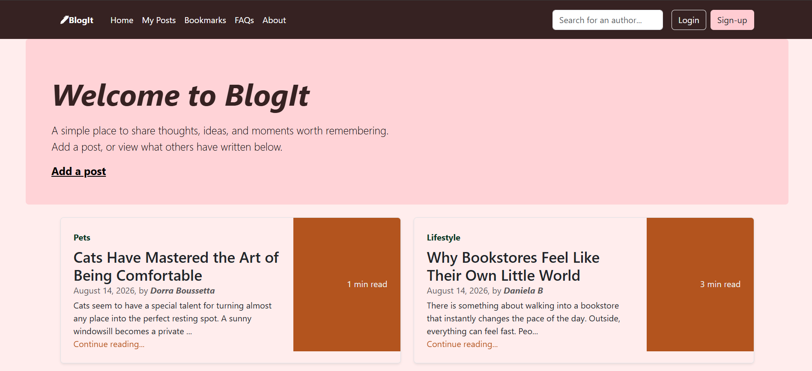

### Homepage - Logged In

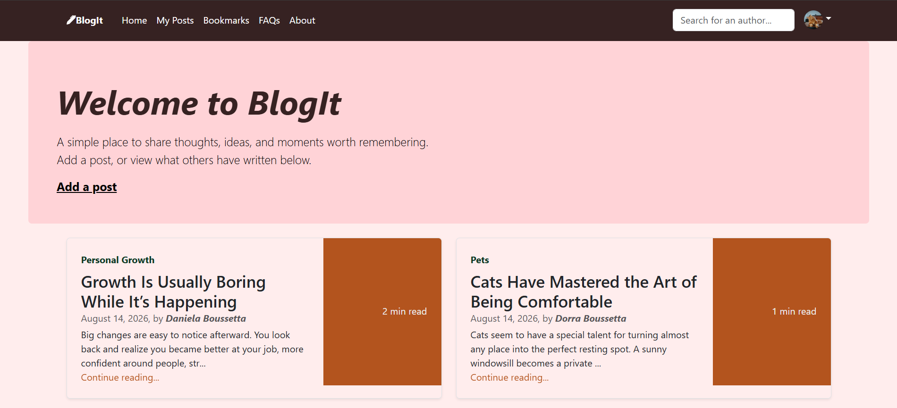

### Login Page

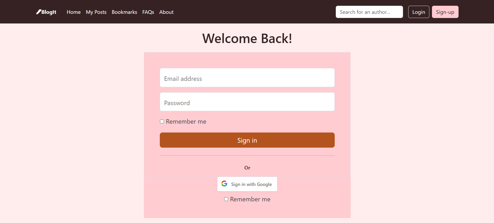

### Signup Page

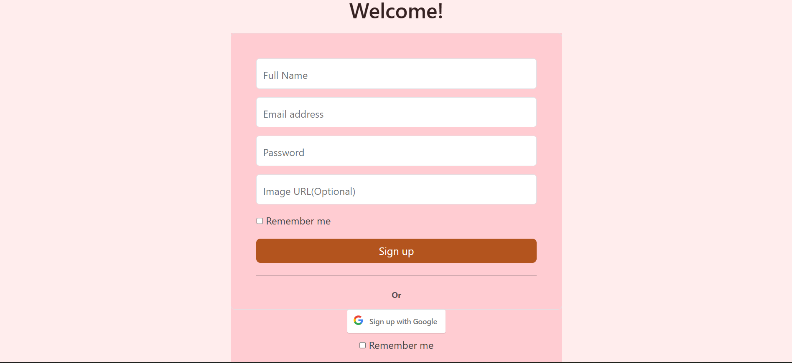


### Add Post Page

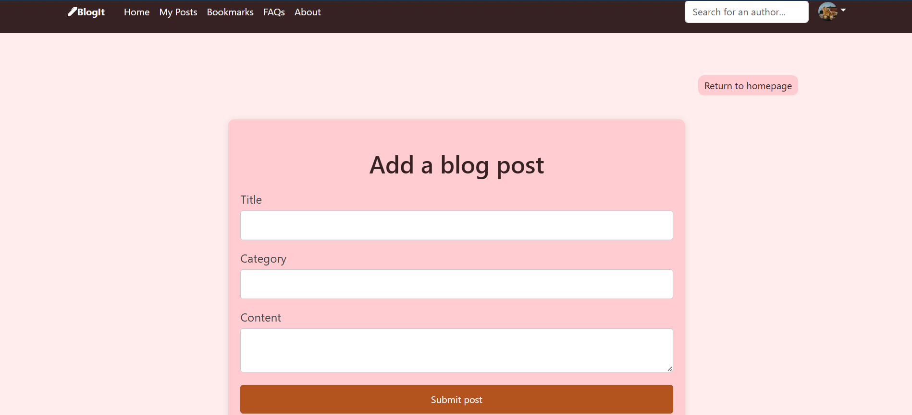

### Edit Post Page

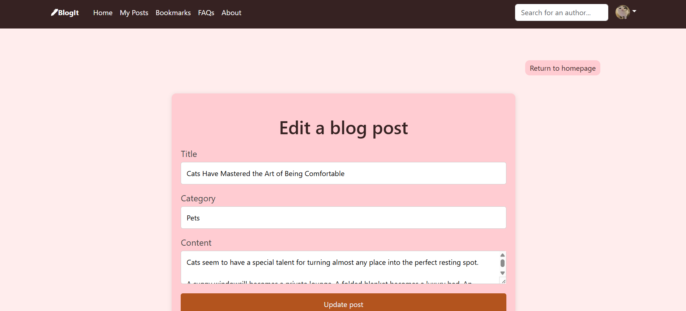

### My Posts Page

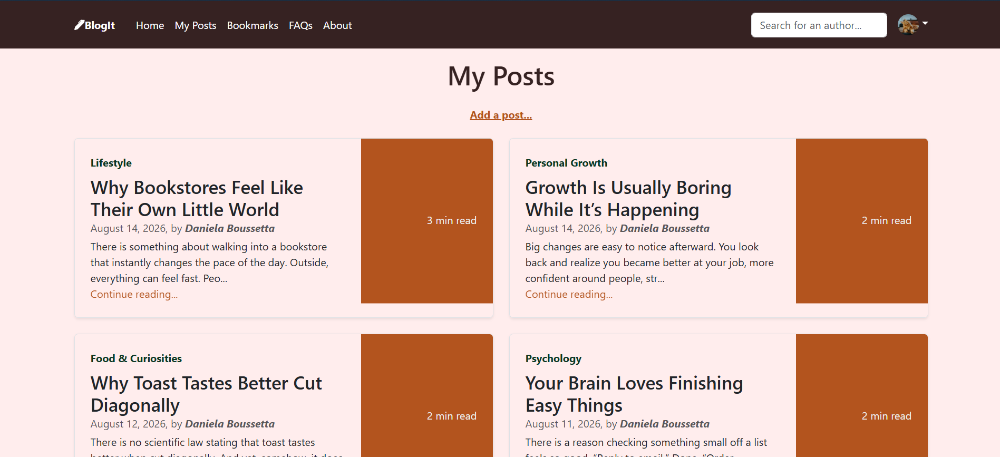

### Full Post Page

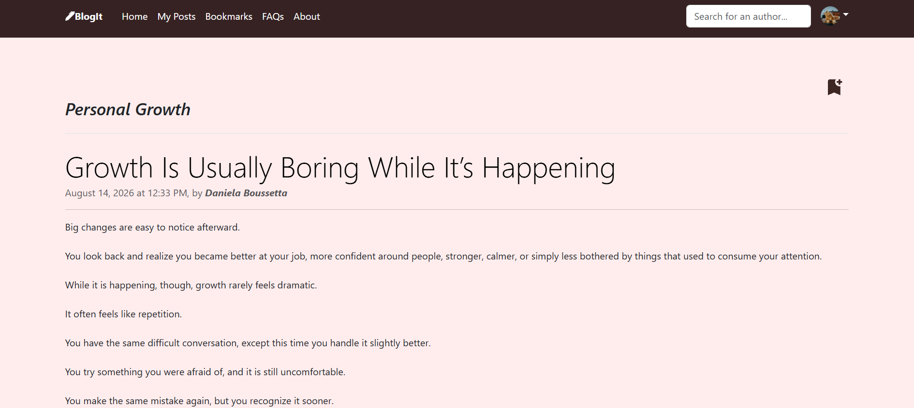

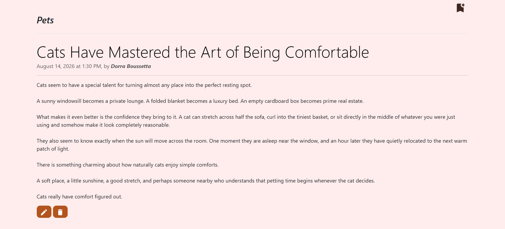

### Comments Section


### Bookmarks Page

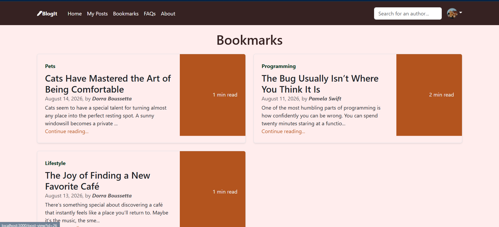

### Search Page

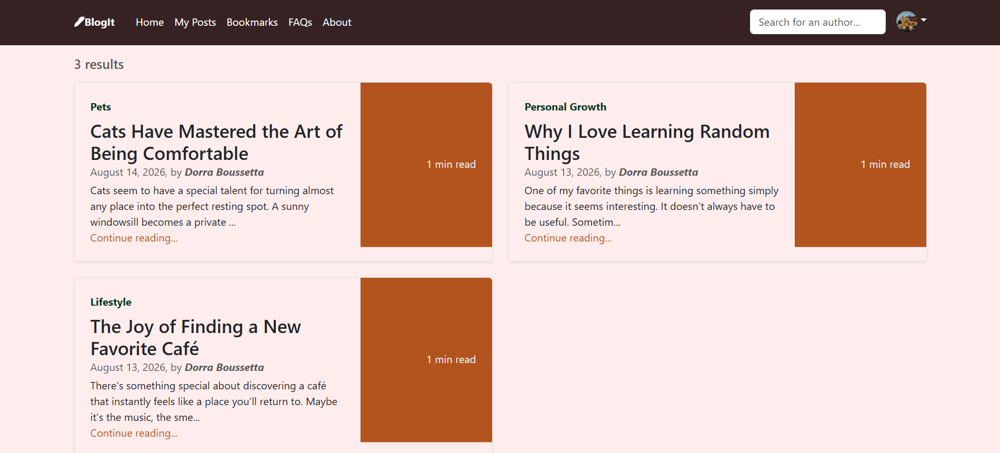

### Profile Page


### Update Profile Page


### Delete Confirmation Modal

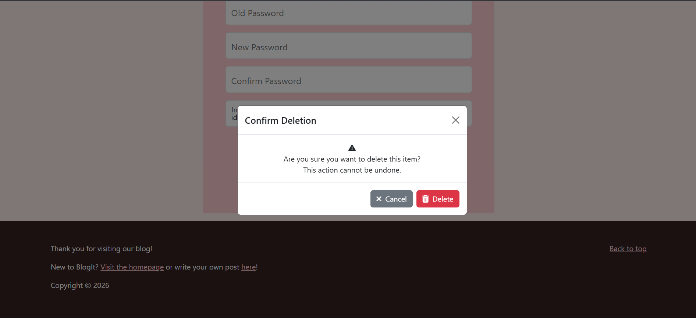

### FAQs Page

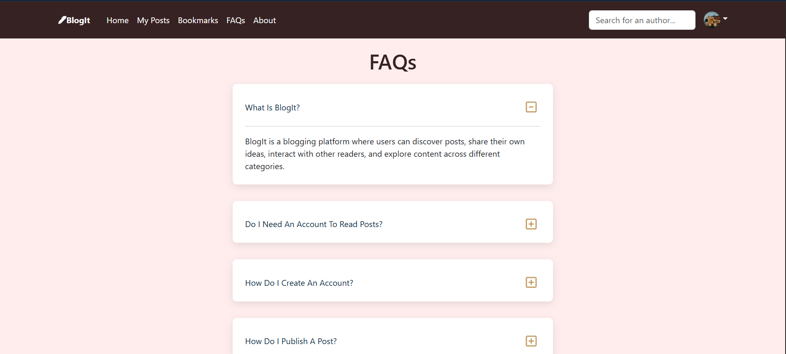

### About Page

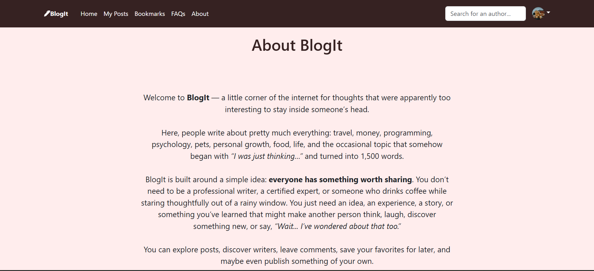


## Installation

Install the backend dependencies:

```bash
npm install
```

Then go into the React folder:

```bash
cd react-ui
```

Install the React dependencies:

```bash
npm install
```

Then return to the main project folder:

```bash
cd ..
```

## Environment Variables

Create a `.env` file in the main project folder.

The project expects environment variables similar to these:

```env
PG_USER=your_postgres_user
PG_HOST=localhost
PG_DATABASE=your_database_name
PG_PASSWORD=your_postgres_password
PG_PORT=5432

SESSION_SECRET=your_session_secret

GOOGLE_CLIENT_ID=your_google_client_id
GOOGLE_CLIENT_SECRET=your_google_client_secret
```

## Running the Project

The backend and React development server need to run at the same time during development.

From the main project folder, run the Express server:

```bash
nodemon index.js
```

Or:

```bash
node index.js
```

Then, in a second terminal, go into the React folder:

```bash
cd react-ui
```

Run the React/Vite development server:

```bash
npm run dev
```

The Express server runs locally on:

```text
http://localhost:3000
```

The React/Vite development server runs locally on:

```text
http://localhost:5173
```

The EJS pages are served by Express, while React components are loaded from the Vite development server during development.

## Important Notes

This project is a Node.js, Express.js, PostgreSQL, EJS, and React application. It cannot be hosted directly with GitHub Pages because it needs a running backend server and a database connection.

## Project Structure

```text
BLOG_WEBSITE/
├── index.js
├── package.json
├── package-lock.json
├── .gitignore
├── public/
│   └── style.css
├── react-ui/
│   ├── index.html
│   ├── package.json
│   ├── package-lock.json
│   ├── vite.config.js
│   ├── eslint.config.js
│   ├── .gitignore
│   ├── README.md
│   ├── public/
│   └── src/
│       ├── main.jsx
│       ├── UserArea.jsx
│       ├── HomePagePosts.jsx
│       ├── MyPosts.jsx
│       ├── Bookmarks.jsx
│       ├── CommentsSection.jsx
│       ├── SearchedPosts.jsx
│       ├── assets/
│       ├── LoginSrc/
│       │   ├── LoginButton.jsx
│       │   ├── SignUpButton.jsx
│       │   └── UserDropdown.jsx
│       └── PostsSrc/
│           ├── PostPreviewCard.jsx
│           ├── FullPostCard.jsx
│           ├── CommentForm.jsx
│           └── CommentCard.jsx
├── screenshots/
│   ├── About-page.png
│   ├── Add-Post.png
│   ├── Bookmarks-Page.png
│   ├── Comments Section.png
│   ├── Confirm-aDeletion.png
│   ├── FAQs-Page.png
│   ├── Full-post.png
│   ├── Full-post2.png
│   ├── Home-Page-LoggedIn.png
│   ├── Home-Page-LoggedOut.png
│   ├── Login-Page.png
│   ├── MyPosts-Page.png
│   ├── Profile-page.png
│   ├── Search-Page.png
│   ├── Update-Profile V1.png
│   └── Update-Profile V2.png
├── views/
│   ├── about.ejs
│   ├── bookmarks.ejs
│   ├── edit-profile.ejs
│   ├── faqs.ejs
│   ├── index.ejs
│   ├── login.ejs
│   ├── my-posts.ejs
│   ├── post-add.ejs
│   ├── post-update.ejs
│   ├── post-view.ejs
│   ├── profile-page.ejs
│   ├── search-page.ejs
│   ├── signup.ejs
│   └── partials/
│       ├── header.ejs
│       └── footer.ejs
└── README.md
```

## Main Upgrade Summary

The original version of BlogIt was a backend/EJS CRUD practice project.

The upgraded version turns it into a more complete full-stack application.

### Main improvements include:

- Temporary array storage replaced with PostgreSQL database storage
- Basic anonymous blog posts replaced with user-owned posts
- No authentication replaced with local and Google authentication
- Static EJS-only rendering expanded with React-powered dynamic sections
- Basic CRUD expanded with comments, likes, bookmarks, search, profiles, and protected pages
- Simple server-side state replaced with persistent database-backed data
- Basic page navigation improved with user-aware navbar behavior
- Basic project structure expanded into backend, EJS views, React components, API routes, and database-backed functionality

## Status

Upgraded version completed as a full-stack blog website project using Express, EJS, PostgreSQL, authentication, and React.